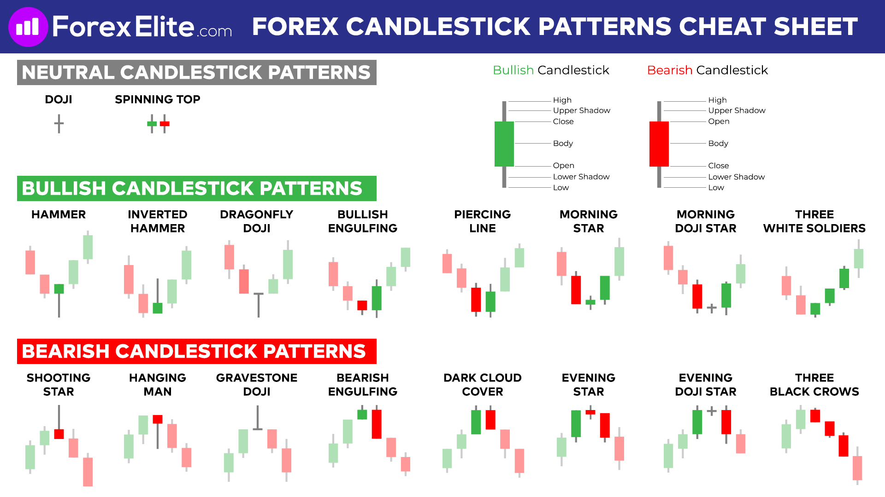
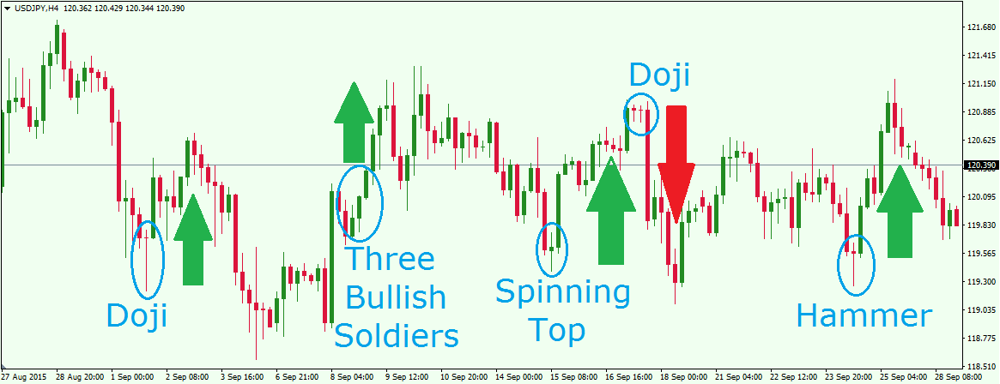

# Trading

## Indicators

### RSI - Relative Strength Index

### MA - Moving Average

### BB - Bollinger Bands

### SMA - Simple Moving Average

## Patterns

### Bullish Patterns
#### Bullish Pennant

